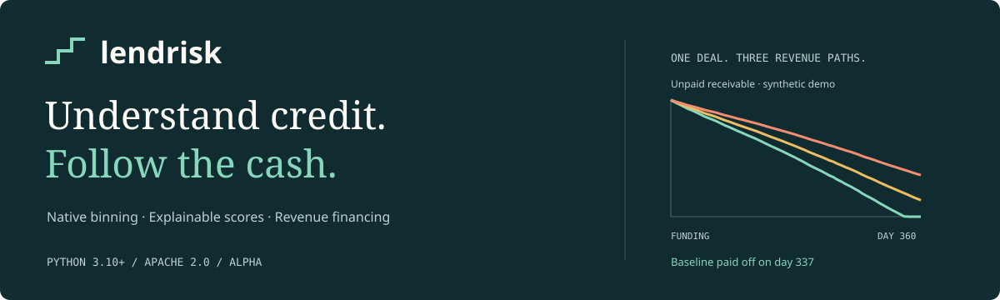
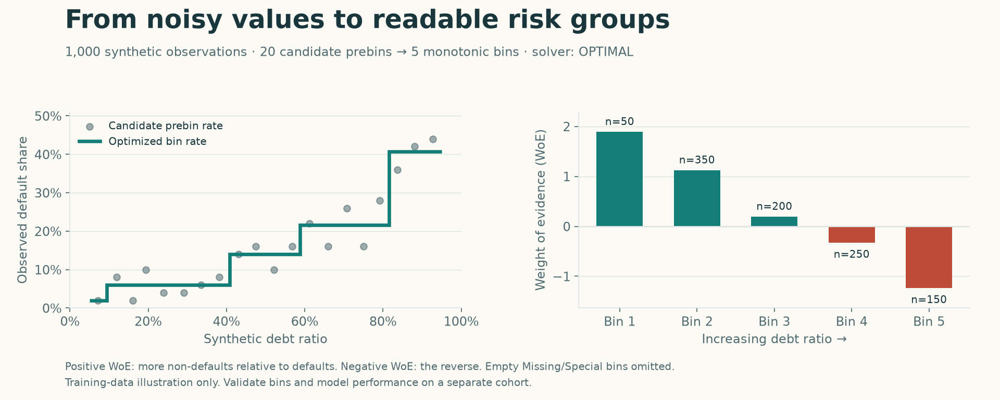
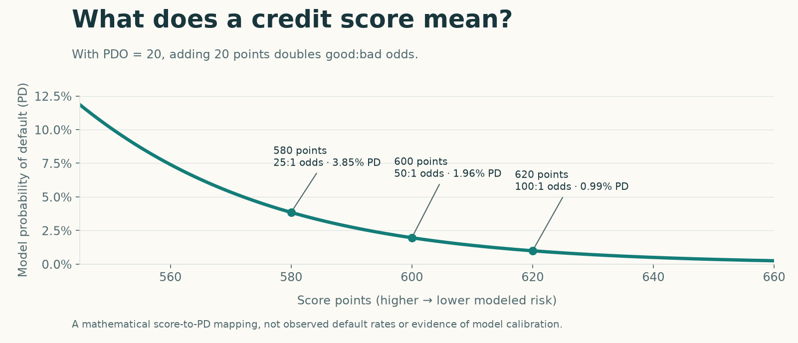

[](https://github.com/datakim/lendrisk/actions/workflows/ci.yml)
[](pyproject.toml)
[](LICENSE)
[](https://github.com/datakim/lendrisk/releases)

**Credit risk and cash-flow lending tools you can install and run in Python.**
Build readable credit scores, extract merchant cash-flow features, and explore
how revenue-linked financing behaves when sales change. Works locally with NumPy,
pandas, scikit-learn, and a native OR-Tools binning solver.

**[Start here](https://datakim.github.io/lendrisk/quickstart/)** ·
[Documentation](https://datakim.github.io/lendrisk/) · [Notebooks](notebooks/) ·
[API reference](docs/api.md) · [Releases](https://github.com/datakim/lendrisk/releases)

## See the question, then the answer

*“If this merchant's sales fall, when do we get paid—and how much cash is left?”*


The same 30,000 advance behaves differently across three supplied revenue paths.
The left chart tracks unpaid receivables; the right tracks merchant cash after
operating costs and financing payments. The example uses synthetic data. Each
shock changes revenue while retaining the original operating-cost path.

## Try it in a minute

Python **3.10+** and Git are required. Install the tagged alpha:

```bash
python -m pip install "git+https://github.com/datakim/lendrisk.git@v0.1.0a1"
```

Run this complete example in a Python file or notebook:

```python
from lendrisk import RevenueAdvance, RevenueShock, compare_scenarios, make_merchant_cashflows

data = make_merchant_cashflows(days=540, seed=42)
future = data.iloc[180:]  # A synthetic 360-day path after 180 historical days.
advance = RevenueAdvance(principal=30_000, factor_rate=1.12, holdback_rate=0.10)
report = compare_scenarios(
    advance,
    future,
    [RevenueShock("sales_down_20pct", 0.8), RevenueShock("sales_down_40pct", 0.6)],
    opening_cash=5_000,
)
print(report[["repaid", "payoff_days", "remaining_balance", "minimum_cash_balance"]].round(0))
```

The output, rounded to whole currency units:

| Revenue path | Repaid within 360 days? | Payoff day | Still unpaid | Lowest end-of-day cash |
| --- | --- | --- | ---: | ---: |
| Baseline | Yes | 337 | 0 | 35,363 |
| Sales −20% | No | — | 4,755 | 35,151 |
| Sales −40% | No | — | 11,967 | −4,444 |

**Read the result:** `repaid=False` means a balance remains at the end of this
path. Negative cash indicates a liquidity shortfall under the scheduled-payment
assumption. Neither automatically labels a merchant as defaulted. The 1.12
factor sets a 33,600 receivable; the 10% holdback takes 10% of each day's revenue
until it is paid. A factor rate is a repayment multiple, not an annual rate.

→ [Walk through every step](docs/tutorials/revenue-financing.md) ·
[Run the notebook](notebooks/01_revenue_financing.ipynb) ·
[Use your own CSV](docs/your-data.md)

## Choose your workflow

| I want to… | Start with | What I get |
| --- | --- | --- |
| Group a credit variable into readable risk bands | `OptimalBinning` | Constrained bins, default rates, WoE, and solver status |
| Build an explainable credit score | `LogisticScorecard` | Default probabilities, score points, per-bin contributions |
| Understand recent merchant cash flow | `cashflow_features` | Revenue, growth, volatility, coverage, and operating margins at a cutoff date |
| Explore MCA / revenue-based finance mechanics | `RevenueAdvance`, `RevenueShock` | Daily payments, payoff timing, remaining receivables, and liquidity |
| Evaluate a model or portfolio | `credit_metrics`, `expected_loss`, `population_stability_index` | Discrimination, probability errors, expected loss, and distribution drift |
| Analyze installments and dated returns | `TermLoan`, `xirr`, `xnpv` | Payment schedules and dated cash-flow calculations |

## Make credit variables easier to read



Native binning chooses contiguous numerical groups that separate defaults from
non-defaults while respecting constraints such as minimum bin size and monotonic
default rates. **Weight of evidence (WoE)** summarizes that separation for a
scorecard. This chart uses 1,000 synthetic observations; it shows training data,
not a validation result.

```python
import numpy as np
from lendrisk import OptimalBinning

rng = np.random.default_rng(42)
debt_ratio = rng.uniform(0.05, 0.95, 1_000)
default = rng.binomial(1, 0.02 + 0.42 * debt_ratio**2)
bins = OptimalBinning(max_n_bins=5, monotonic_trend="ascending").fit(debt_ratio, default)
print(bins.table()[["bin", "count", "event_rate", "woe"]])
```

→ [Binning and scorecards tutorial](docs/tutorials/scorecards.md) ·
[Scorecard notebook](notebooks/02_native_scorecard.ipynb)

## Scores you can explain



`LogisticScorecard` fits native bins followed by logistic regression. Higher
points mean lower modeled default risk. At the default scale, **20 extra points
double the good:bad odds**. `model.table()` exposes each variable's bin and point
contribution; `model.intercept_points` is added once. The chart illustrates the
scale formula, not measured model accuracy or calibration.

## What is ready today?

This is an **alpha** with numerical features, binary credit targets, and
explicit daily financing simulations. The binning core adapts selected
OptBinning code under Apache 2.0 and runs without importing OptBinning.
Categorical/multiclass binning, automated revenue forecasts, and regulatory
reporting are outside the current scope. [See provenance and differences](docs/upstream.md).

Model fitting belongs inside the training boundary. Supply the event definition,
observation date, future path, and agreement terms for your use case; the toolkit
does not infer them. [Calculation conventions](docs/conventions.md) document
missing dates, smoothing, cash accounting, solver statuses, and return formulas.

## Explore, contribute, reproduce

Clone the repository to run all examples and regenerate these figures:

```bash
git clone https://github.com/datakim/lendrisk.git
cd lendrisk
python -m venv .venv
source .venv/bin/activate  # Windows PowerShell: .venv\Scripts\Activate.ps1
python -m pip install -e ".[dev,docs]"
python examples/quickstart.py
python examples/visual_walkthrough.py
mkdocs serve
```

Figures are generated from package outputs by
[visual_walkthrough.py](examples/visual_walkthrough.py). Their
[scenario summaries](docs/assets/scenario-summary.json) and
[binning table](docs/assets/binning-table.csv) are included for inspection.
The notebooks contain executed synthetic examples and can also be opened in Colab.

[Contributing](CONTRIBUTING.md) · [Roadmap](docs/project-plan.md) ·
[Research](docs/research.md) · [Presentation references](docs/presentation.md) ·
[Glossary](docs/glossary.md)

Licensed under [Apache 2.0](LICENSE). Upstream attribution is preserved in
[NOTICE](NOTICE) and [the provenance notes](docs/upstream.md).
